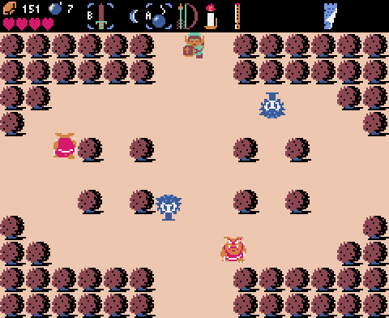

# ミニゼルダ

[ゼルダの伝説](https://www.nintendo.co.jp/software/zelda1/)を参考にしました。

## 操作方法

* キーボード、又はゲームパッドで操作します。
  * 【Z】【CTRL】・・・攻撃（ゲームパッドのAボタン）
  * 【X】【SHIFT】・・・アイテム使用（ゲームパッドのBボタン）
  * 【Z】【TAB】・・・アイテム選択（ゲームパッドのXボタン）
  * 【スペース】・・・一時停止（ゲームパッドのYボタン）
  * 【←】【→】【↑】【↓】・・・移動（ゲームパッドの十字キー）

## 遊び方

* まず、洞窟に入って、ソードとルピーをもらいましょう。
* 次に、お店を見つけて、爆弾、ロウソク、その他を手に入れましょう。
* そして、爆弾やロウソクで隠し扉を見つけましょう。
* 最後に、ボスを倒して、姫を救い出しましょう。

## 特徴

* マップはランダムです。
* 最終ボスはグリオークです。マジカルソード、銀の矢、爆弾しか効きません。
* 敵を倒すと、割とルピーや爆弾が手に入ります。
* 妖精や時計、マジカルシールドやいかだなどのアイテムはありません。
* 持てるルピーに上限はありません。
* ライフはハート６個までです。
* やられても、アイテムが減ることなくコンティニューし放題です。
* 適当にやっていても、適当にアイテムが手に入ります。
